# Wyniki analizy – opis wykresów

Wszystkie wykresy generowane są do katalogu `plots/` po uruchomieniu `python main.py`.

---

## Lab 6 – Pandas + Matplotlib

### Rozkład cen ogłoszeń
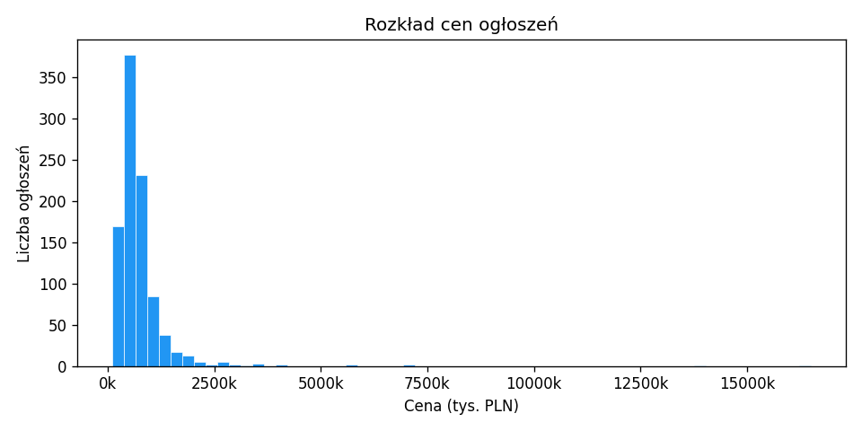
Większość mieszkań wyceniona jest między 300k a 900k PLN, z długim ogonem w stronę droższych nieruchomości.

---

### Mediana ceny za m² – top 10 miast
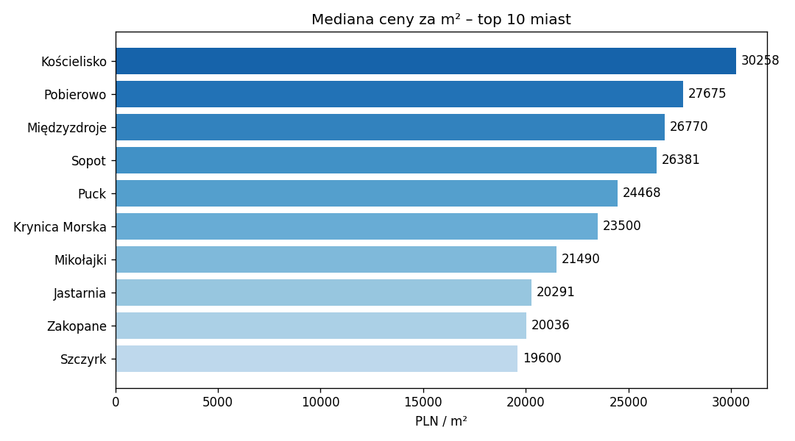
Porównanie mediany ceny za m² dla 10 najdroższych rynków lokalnych w Polsce.

---

### Powierzchnia a cena
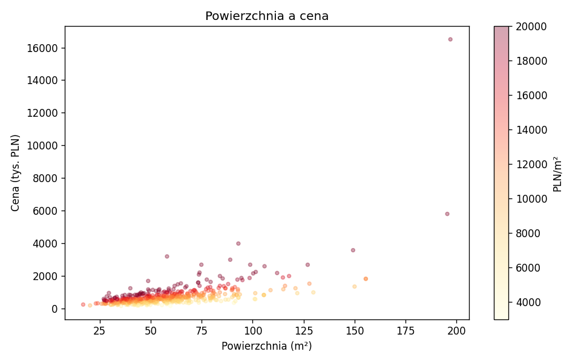
Wykres punktowy z kolorowaniem wg ceny za m² (żółty = tani, czerwony = drogi). Widoczna liniowa korelacja z rozrzutem dla lokalizacji premium.

---

### Rozkład liczby pokoi
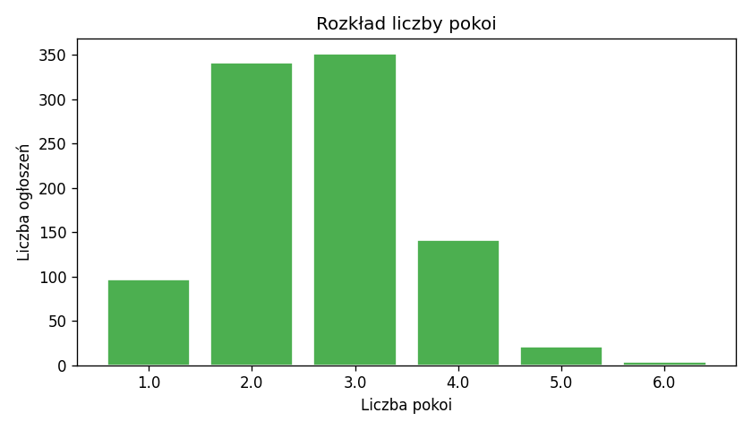
Dominują mieszkania 2- i 3-pokojowe.

---

### Cena wg liczby pokoi (box plot)
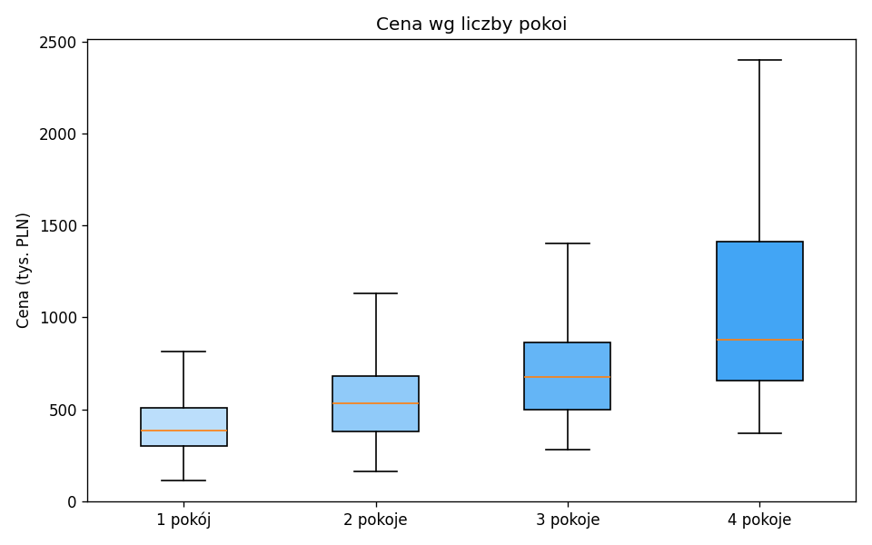
Mediany i rozrzut cen w każdej kategorii pokoi, bez wartości odstających.

---

## Lab 5 – Text Mining + Word Cloud

### Word Cloud
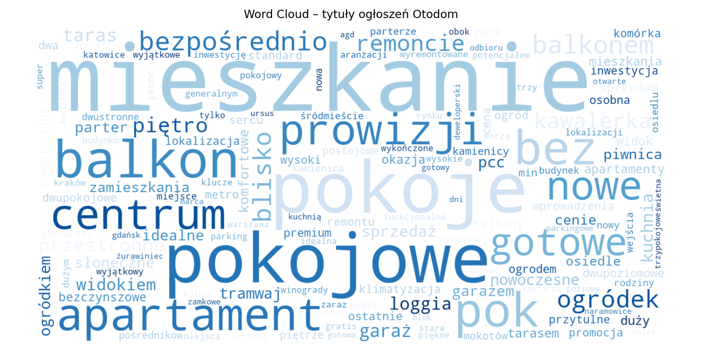
Chmura słów z tytułów ogłoszeń po usunięciu stop words. Dominują: *mieszkanie*, *pokoje*, *balkon*, *centrum*, *apartament*.

---

### Top 30 słów
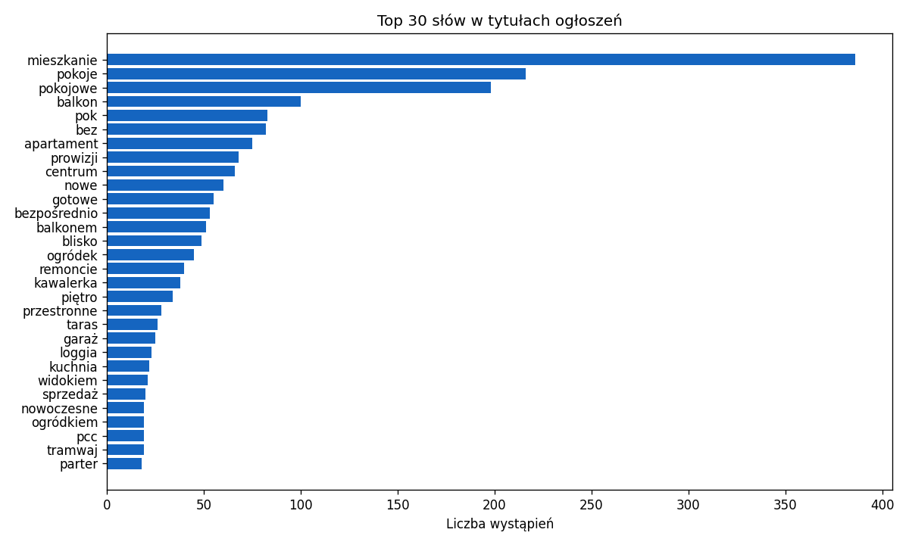
Najczęściej występujące słowa w tytułach ogłoszeń.

---

### Top 20 bigramów
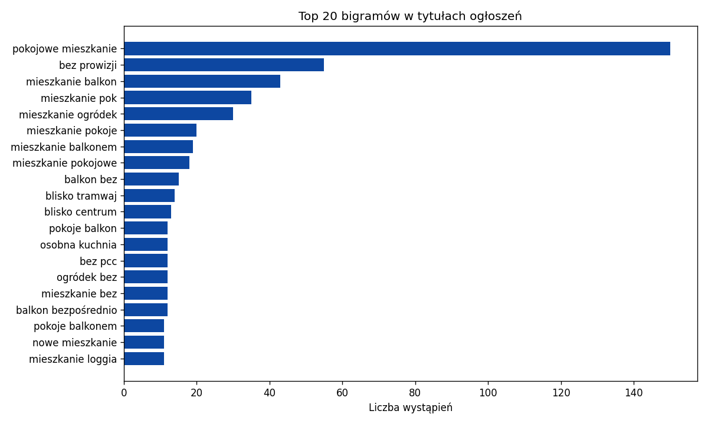
Najczęstsze pary słów, np. *"pokojowe mieszkanie"*, *"bez prowizji"*, *"mieszkanie balkon"*.

---

## Lab 4 – Uczenie maszynowe

Modele przewidują cenę mieszkania na podstawie: powierzchnia, liczba pokoi, piętro, wskaźnik cenowy miasta, prywatny/agencja.

### Rzeczywista vs przewidywana cena
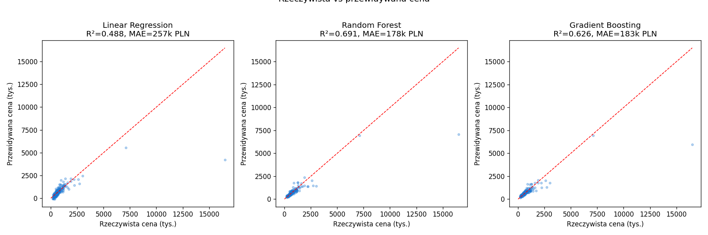
Im bliżej czerwonej linii 45°, tym lepszy model. Random Forest radzi sobie najlepiej.

---

### Porównanie modeli
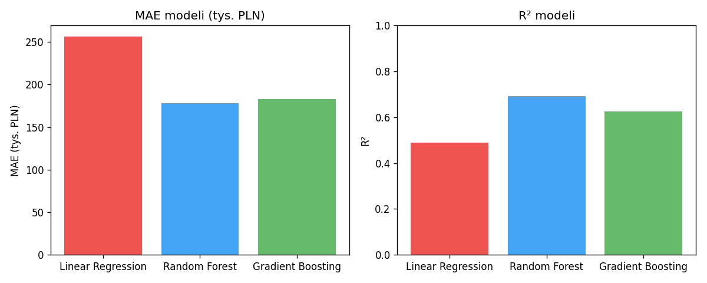

| Model | MAE | R² |
|---|---|---|
| Linear Regression | ~257k PLN | 0.49 |
| Random Forest | ~178k PLN | 0.69 |
| Gradient Boosting | ~183k PLN | 0.63 |

---

### Ważność cech (Random Forest)
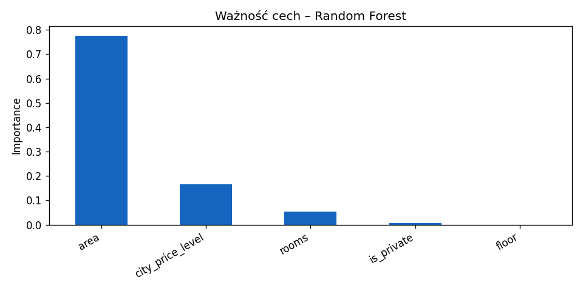
Powierzchnia i poziom cenowy miasta mają największy wpływ na przewidywaną cenę.
